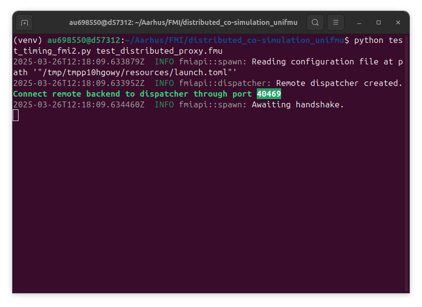
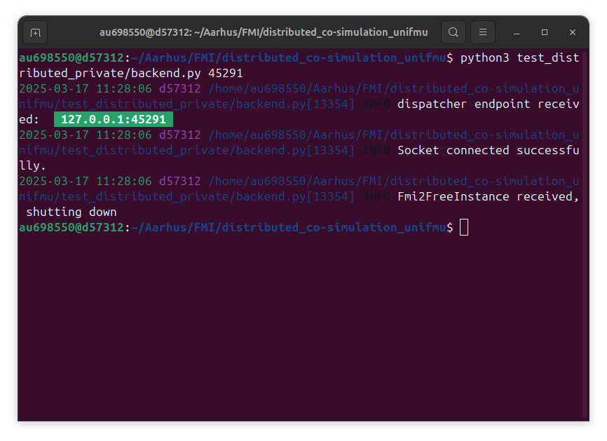
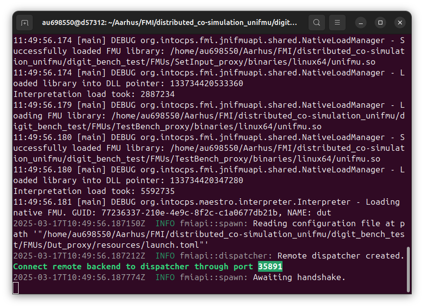
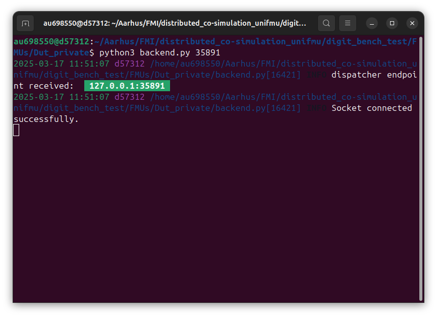

# Example distributed co-simulation with UniFMU
This repository shows two examples of how to run a distributed co-simulation using the p2p distributed feature of UniFMU.
The first example is about a co-simulation of one FMU, which is split into a proxy FMU and a remote model.
The second example is about a co-simulation of three FMUs, in which each FMU is split into a proxy FMU-model pair.
These examples relies on the following technologies:
- [FMPy](https://github.com/CATIA-Systems/FMPy) for the co-simulation of an individual FMU.
- [Maestro co-simulation](https://github.com/INTO-CPS-Association/maestro) for the co-simulation of multiple FMUs.

## Instructions for the co-simulation of an individual FMU.
1. Create the proxy-model pair of a test FMU using the following command of UniFMU (for its version with the feature for distributed co-simulation):
    ```
    ./unifmu generate-distributed python test_distributed --zipped
    ```
    This command generates two archives, namely, `test_distributed_proxy.fmu`, which is the proxy FMU, and the folder `test_distributed_private`, which is the model (this is not an FMU).
    For this test, we won't change anything in the FMU. It will run the default application.
2. In the `test_distributed_private`, there is a file called `endpoint.toml` with a field `ip`. It's default value is `127.0.0.1`, which is the localhost. **Note:** In case the example is to be run in two different PCs (under a known IP address or public URL), this field needs to be changed accordingly.
3. Run the Python script `test_timing_fmi2.py` as follows:
    ```
    python test_timing_fmi2.py test_distributed_proxy.fmu
    ```
    This script will start the proxy FMU, which will wait for the model to connect to the opened port as follows:
    
    In this case, the proxy FMU opens the port `32901`. We need this port to start the model.
4. In a different process start the model as follows (**Note:** remember to change the port accordingly):
    ```
    python test_distributed_private/backend.py 32901
    ```
    This will start the peer-to-peer communication between proxy and model until completion, which is seen from the model as follows:
    
5. When finished, the process that ran the `test_timing_fmi2.py` script will compute and print the time the co-simulation required for completion.

## Instructions for the co-simulation of multiple FMUs. {#co-sim-heading}
In this co-simulation (located in the folder `digit_bench_test`), we will use three existing models created with Modelica in a distributed co-simulation.
Since the models have already been created, we don't need to update the model logic but reuse the generated FMU from Modelica instead.
To do so, we will create proxy-model pairs with UniFMU, where the model part contains an existing black-box FMU. This applies to the three existing models.
The model names are: `Dut`, `TestBench`, and `SetInput`. We have three FMUs for the three respective models, namely, `Dut.fmu`, `TestBench.fmu`, and `SetInput.fmu`.

1. Create the three proxy-model pairs with UniFMU using the following commands:
    ```
    ./unifmu generate-distributed python Dut --black-box-fmu
    ```
    ```
    ./unifmu generate-distributed python TestBench --black-box-fmu
    ```
    ```
    ./unifmu generate-distributed python SetInput --black-box-fmu
    ```
    These three commands will generate six archives, `Dut_proxy`, `Dut_private`, `TestBench_proxy`, `TestBench_private`, `SetInput_proxy`, and `SetInput_private`. The existing FMUs are to be placed in the corresponding folders with suffix `_private` and must have the same name of the folder without the suffix `_private`. Finally, these archives are to be placed in the directory `digit_test_bench/FMUs` (as provided already).
2. Update the `ModelDescription.xml` in each folder with suffix `_proxy` using the existing `ModelDescription.xml` in the existing FMUs `Dut.fmu`, `TestBench.fmu`, and `SetInput.fmu`.
3. Update the fields `maestro_path` and `maestro_jar` in the script `execute_cosimulation.sh` with your installation parameters.
4. (Optional) Update the `ip` field of the `endpoint.toml` files in the folders with suffix `_private` with the corresponding IP adress or valid URL of the server which is to execute the co-simulation.
5. Execute the co-simulation with Maestro using the script `execute_cosimulation.sh`. This will start initializing each proxy FMU in the co-simulation as follows:

6. For each FMU initialized by Maestro, run the corresponding model from a different process with the printed port information, as follows (using the Dut proxy-model pair):

7. (Optional) If using the folders provided, since the binaries for Linux and Windows have been generated using different Modelica versions, the initialization of the existing FMU by the step 6 may complain because of the `guid` field in the existing FMU inside the `_private` folder (for example, the `Dut.fmu` inside the `Dut_private` folder). If this happens, the `ModelDescription.xml` files of that FMU needs to be updated with the requested `guid`.
8. (Optional) If using the folders provided, when the co-simulation is finished, each process running a model will print the time the co-simulation required for completion. The last FMU being initialized will provide a rough idea of the time the co-simulation took.
9. The results of the co-simulation, stored by Maestro, will be available in the file `digit_bench_test/results/outputs.csv` after the co-simulation has finished.

## Troubleshooting
- In case one of the examples fails, double check the installation of FMPy and Maestro. Notice that Maestro also requires a Java installation (> Java 11).
- In case the distributed co-simulation is not continuing after having initialized the proxies and the models, double check the `IP` field in the `endpoint.toml` files in the folders with suffix `_private` and that the port being passed to the models during the `python backend.py PORT` is the same printed by the proxy.
- In case the initialization of the black-box FMUs complain due to the `GUID` field, follow Step 7 in [These instructions](#co-sim-heading).
- If using a different setting different to localhost, account that the co-simulation will take longer due to network delays.