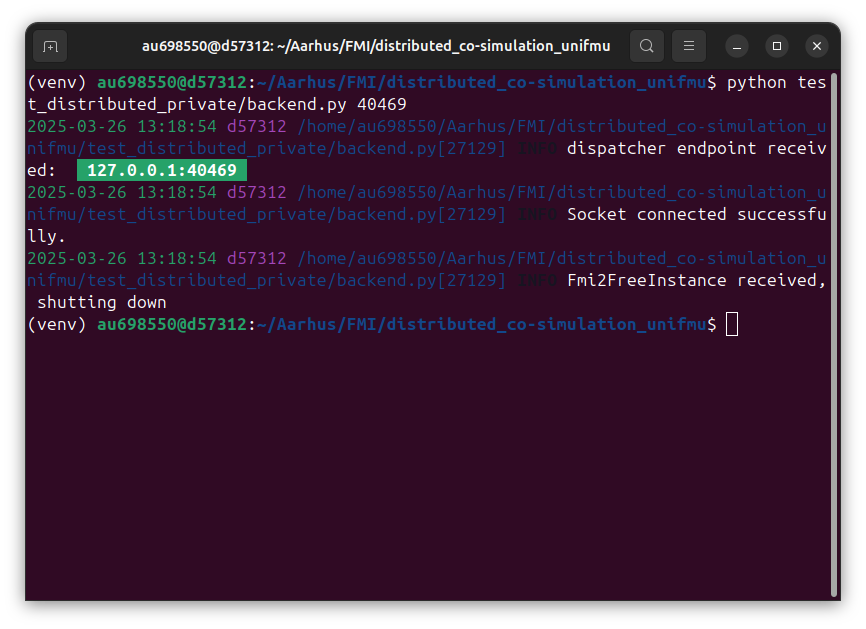

# Example distributed co-simulation with UniFMU
This repository shows two examples of how to run a distributed co-simulation using the p2p distributed feature of UniFMU.
The first example is about a co-simulation of one FMU, which is split into a proxy FMU and a remote model.
The second example is about a co-simulation of three FMUs, in which each FMU is split into a proxy FMU-model pair.
These examples rely on the following technologies (which need to be installed):
- [FMPy](https://github.com/CATIA-Systems/FMPy) for the co-simulation of an individual FMU.
- [Maestro co-simulation](https://github.com/INTO-CPS-Association/maestro) for the co-simulation of multiple FMUs.

## Overview of the repository
- [Example of distributed co-simulation with UniFMU](#example-distributed-co-simulation-with-unifmu)
  - [Overview of the repository](#overview-of-the-repository)
  - [Instructions for the co-simulation of an individual FMU](#instructions-for-the-co-simulation-of-an-individual-fmu)
  - [Instructions for the co-simulation of multiple FMUs](#instructions-for-the-co-simulation-of-multiple-fmus)
  - [Troubleshooting](#troubleshooting)

```
📦Root folder
 ┣ 📂digit_bench_test (files for the demo with multiple FMUs)
 ┃ ┣ 📂FMUs (directory where the FMUs for the demo and the original are stored)
 ┃ ┃ ┣ 📂Dut_private (model of the distributed Dut)
 ┃ ┃ ┣ 📂Dut_proxy (proxy of the distributed Dut)
 ┃ ┃ ┣ 📂original (original FMUs generated with Modelica - versions for Windows and Linux)
 ┃ ┃ ┃ ┣ 📂Linux
 ┃ ┃ ┃ ┃ ┣ 📂Dut
 ┃ ┃ ┃ ┃ ┣ 📂SetInput
 ┃ ┃ ┃ ┃ ┣ 📂TestBench
 ┃ ┃ ┃ ┃ ┣ 📜Dut.fmu
 ┃ ┃ ┃ ┃ ┣ 📜SetInput.fmu
 ┃ ┃ ┃ ┃ ┗ 📜TestBench.fmu
 ┃ ┃ ┃ ┗ 📂Windows
 ┃ ┃ ┃ ┃ ┣ 📂Dut
 ┃ ┃ ┃ ┃ ┣ 📂SetInput
 ┃ ┃ ┃ ┃ ┣ 📂TestBench
 ┃ ┃ ┃ ┃ ┣ 📜Dut.fmu
 ┃ ┃ ┃ ┃ ┣ 📜SetInput.fmu
 ┃ ┃ ┃ ┃ ┗ 📜TestBench.fmu
 ┃ ┃ ┣ 📂SetInput_private (model of the distributed SetInput)
 ┃ ┃ ┣ 📂SetInput_proxy (proxy of the distributed SetInput)
 ┃ ┃ ┣ 📂TestBench_private (model of the distributed TestBench)
 ┃ ┃ ┣ 📂TestBench_proxy (proxy of the distributed TestBench)
 ┃ ┃ ┣ 📜Dut_proxy.fmu
 ┃ ┃ ┣ 📜SetInput_proxy.fmu
 ┃ ┃ ┗ 📜TestBench_proxy.fmu
 ┃ ┣ 📂generate (specific to Maestro)
 ┃ ┣ 📂results (output folder of the co-simulation)
 ┃ ┣ 📂target (specific to Maestro)
 ┃ ┣ 📜commands.sh (miscellaneous functions to create the model-proxy pairs with unifmu and wrap the proxies as ZIP files)
 ┃ ┣ 📜distributed_cosimulation.json (Maestro specification for the co-simulation)
 ┃ ┗ 📜execute_cosimulation.sh (script to execute the co-simulation with the given specification)
 ┣ 📂figures (miscellaneous for the repository)
 ┣ 📂ModelDescriptions (ModelDescription.xml files for the demo with multiple FMUs)
 ┃ ┣ 📂Dut_proxy
 ┃ ┣ 📂SetInput_proxy
 ┃ ┗ 📂TestBench_proxy
 ┣ 📂test_distributed_private (model of the demo of an individual FMU)
 ┃ 📜readme.md
 ┃ 📜test_distributed_proxy.fmu (proxy of the demo of an individual FMU)
 ┃ 📜test_timing_fmi2.py (script for running the demo of an individual FMU)
 ┃ unifmu (binary for Linux)
 ┗ unifmu.exe (binary for Windows)
```

## Instructions for the co-simulation of an individual FMU.
1. Create the proxy-model pair of a test FMU using the following command of UniFMU (for its version with the feature for distributed co-simulation):
    ```
    ./unifmu generate-distributed python test_distributed --zipped
    ```
    This command generates two archives, namely, `test_distributed_proxy.fmu`, which is the proxy FMU, and the folder `test_distributed_private`, which is the model (this is not an FMU).
    For this test, we won't change anything in the FMU. It will run the default application.
2. In the `test_distributed_private`, there is a file called `endpoint.toml` with a field `ip`. It's default value is `127.0.0.1`, which is the localhost. **Note:** In case the example is to be run in two different PCs (under a known IP address or public URL), this field needs to be changed accordingly.
3. Run the Python script `test_timing_fmi2.py` as follows:
    ```
    python test_timing_fmi2.py test_distributed_proxy.fmu
    ```
    This script will start the proxy FMU, which will wait for the model to connect to the opened port as follows:
    
    In this case, the proxy FMU opens the port `32901`. We need this port to start the model.
4. In a different process start the model as follows (**Note:** remember to change the port accordingly):
    ```
    python test_distributed_private/backend.py 32901
    ```
    This will start the peer-to-peer communication between proxy and model until completion, which is seen from the model as follows:
    
5. When finished, the process that ran the `test_timing_fmi2.py` script will compute and print the time the co-simulation required for completion.

## Instructions for the co-simulation of multiple FMUs.
In this co-simulation (located in the folder `digit_bench_test`), we will use three existing models created with Modelica in a distributed co-simulation.
Since the models have already been created, we don't need to update the model logic but reuse the generated FMU from Modelica instead.
To do so, we will create proxy-model pairs with UniFMU, where the model part contains an existing black-box FMU. This applies to the three existing models.
The model names are: `Dut`, `TestBench`, and `SetInput`. We have three FMUs for the three respective models, namely, `Dut.fmu`, `TestBench.fmu`, and `SetInput.fmu`.

1. Create the three proxy-model pairs with UniFMU using the following commands:
    ```
    ./unifmu generate-distributed python Dut --black-box-fmu
    ```
    ```
    ./unifmu generate-distributed python TestBench --black-box-fmu
    ```
    ```
    ./unifmu generate-distributed python SetInput --black-box-fmu
    ```
    These three commands will generate six archives, `Dut_proxy`, `Dut_private`, `TestBench_proxy`, `TestBench_private`, `SetInput_proxy`, and `SetInput_private`. The existing FMUs are to be placed in the corresponding folders with suffix `_private` and must have the same name of the folder without the suffix `_private`. Finally, these archives are to be placed in the directory `digit_test_bench/FMUs` (as provided already).
2. Update the `ModelDescription.xml` in each folder with suffix `_proxy` using the existing `ModelDescription.xml` in the existing FMUs `Dut.fmu`, `TestBench.fmu`, and `SetInput.fmu`. To do so, we use the `ModelDescription.xml` files for the proxy FMUs that we have prepared for you, stored in the folder `ModelDescriptions` and with subdirectories according the their respective proxy FMU.
```
cp ModelDescriptions/Dut_proxy/modelDescription.xml digit_bench_test/FMUs/Dut_proxy
```
```
cp ModelDescriptions/SetInput_proxy/modelDescription.xml digit_bench_test/FMUs/SetInput_proxy
```
```
cp ModelDescriptions/TestBench_proxy/modelDescription.xml digit_bench_test/FMUs/TestBench_proxy
```
3. Update the existing FMUs in the `_private` model pairs for your operating system, with those in the folder `digit_bench_test/FMUs/original`.
 - **For Windows**:
 ```
 cp digit_bench_test/FMUs/original/Windows/Dut.fmu digit_bench_test/FMUs/Dut_private
 ``` 
 ```
 cp digit_bench_test/FMUs/original/Windows/SetInput.fmu digit_bench_test/FMUs/SetInput_private
 ``` 
 ```
 cp digit_bench_test/FMUs/original/Windows/TestBench.fmu digit_bench_test/FMUs/TestBench_private
 ``` 
 - **For Linux**:
 ```
 cp digit_bench_test/FMUs/original/Linux/Dut.fmu digit_bench_test/FMUs/Dut_private
 ``` 
 ```
 cp digit_bench_test/FMUs/original/Linux/SetInput.fmu digit_bench_test/FMUs/SetInput_private
 ``` 
 ```
 cp digit_bench_test/FMUs/original/Linux/TestBench.fmu digit_bench_test/FMUs/TestBench_private
 ``` 
4. Update the fields `maestro_path` and `maestro_jar` in the script `execute_cosimulation.sh` with your installation parameters.
5. (Optional) Update the `ip` field of the `endpoint.toml` files in the folders with suffix `_private` with the corresponding IP adress or valid URL of the server which is to execute the co-simulation.
6. Execute the co-simulation with Maestro using the script `execute_cosimulation.sh`. This will start initializing each proxy FMU in the co-simulation as follows:

7. For each FMU initialized by Maestro, run the corresponding model from a different process with the printed port information, as follows (using the Dut proxy-model pair):

8. (Optional) If using the files and folders provided, when the co-simulation is finished, each process running a model will print the time the co-simulation required for completion. The last FMU being initialized will provide a rough idea of the time the co-simulation took.
9. The results of the co-simulation, stored by Maestro, will be available in the file `digit_bench_test/results/outputs.csv` after the co-simulation has finished.

## Troubleshooting
- In case one of the examples fails, double check the installation of FMPy, the Python dependencies, and Maestro. Notice that Maestro also requires a Java installation (> Java 11).
- In case the distributed co-simulation is not continuing after having initialized the proxies and the models, double check the `IP` field in the `endpoint.toml` files in the folders with suffix `_private` and that the port being passed to the models during the `python backend.py PORT` is the same printed by the proxy.
- In case the initialization of the black-box FMUs complain due to the `GUID` field in Step 6 of the demo with multiple FMUs. This occurs since the binaries for Linux and Windows have been generated using different Modelica versions. If this happens, be sure to use the right original FMUs for your operating system, which are stored in the folder `digit_bench_test/FMUs/original/`, following the guidance on Step 3.
- If using a different setting different to localhost, account that the co-simulation will take longer due to network delays.